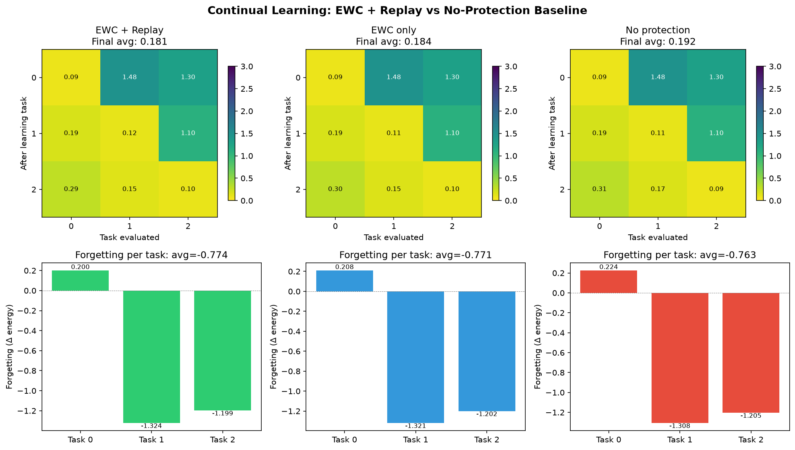

# ContinuaFabric

**Continuous Learning Predictive Coding Networks on JAX**

ContinuaFabric extends the predictive coding (PC) framework with explicit
continual / lifelong learning capabilities.  It builds on
[FabricPC](https://github.com/trueagi-io/FabricPC)'s JAX-native PC engine
(Dr. Matthew Behrend / SingularityNET / ASI Alliance) and fuses ideas from
the latest research on self-modulating architectures, composable expert
stacks, meta-learning, and open-ended self-improvement.

## Why ContinuaFabric?

Predictive coding networks have a structural advantage for continual learning
that has gone largely unexploited in prior work:

- **Local Hebbian learning** — weight updates are node-local, so learning a
  new task does not globally interfere with previous weights.  This is a
  fundamental departure from backprop-based CL, where every weight update
  touches every layer.
- **Separation of inference and learning** — latent states (z) adapt rapidly
  to new inputs via inference iterations while weights (W) change slowly,
  naturally supporting the plasticity–stability tradeoff.
- **Energy-based prediction errors** — each node's energy E(z, μ)
  quantifies its own uncertainty, which can drive dynamic precision
  scheduling, importance-weighted consolidation (EWC), and architecture
  search without auxiliary loss functions.

ContinuaFabric formalises these properties into a practical, tested
continual-learning framework that runs on CPU and GPU.

## Key Ideas

| Layer | Inspiration | What It Does |
|-------|-------------|--------------|
| **ContinualPCEngine** | FabricPC + SOLAR + TFGN | Task-incremental PC training with EWC regularisation, generative replay, and online streaming |
| **SelfModulatingLinear** | Ouroboros (2604.02051) | Micro-controller hypernetwork modulates per-node precision and inference rate based on the energy landscape |
| **AdapterStack** | Brainstacks (2604.01152) + Share (2602.06043) | Frozen base PC graph with low-rank adapter stacks per task; vectorised JAX forward pass |
| **MetaPCLearner** | SOLAR (2605.20189) + Hyperagents (2603.19461) | PC inference loop as meta-optimiser — adapt latents faster across task distributions |
| **EWCBuffer** | Kirkpatrick et al. 2017 | Diagonal Fisher approximated from PC energy gradients per-node |
| **GenerativeReplayBuffer** | Shin et al. 2017 | PC graph generates pseudo-samples; no stored data needed |
| **EnergyBasedArchSearch** | DGM (2505.22954) | PC energy as fitness for graph mutations (insert, skip, prune) |

## Project Structure

```
continua_fabric/
  core/
    continual.py          — ContinualPCEngine, ContinualPCConfig, TaskSchedule
    elastic_weight.py     — EWCBuffer, compute_ewc_penalty, energy_importance
    replay.py             — GenerativeReplayBuffer
  nodes/
    self_modulating.py    — SelfModulatingLinear (micro-controller hypernetwork)
    adapter.py            — AdapterStack (frozen base + low-rank adapters)
  meta/
    meta_pc.py            — MetaPCLearner, meta_pc_train_step
    architecture_search.py — EnergyBasedArchSearch, mutate_graph
  benchmarks/
    continual_benchmarks.py — SplitMNISTBenchmark, PermutedMNISTBenchmark
experiments/
  run_verification.py       — 7-test verification suite
  continual_comparison.py   — EWC vs replay vs no-protection comparison
  split_mnist_demo.py       — Split MNIST continual learning demo
  continual_comparison.png  — Visual comparison plot
```

## Quick Start

```bash
git clone https://github.com/NullLabTests/ContinuaFabric.git
cd ContinuaFabric
python3 -m venv .venv
source .venv/bin/activate
pip install -e ".[dev]"

# Run the 7-test verification suite
python experiments/run_verification.py

# Run the EWC-vs-replay comparison (generates plot)
python experiments/continual_comparison.py
```

## Verification Results

All **7 tests** pass on JAX 0.10.1 (CPU; GPU transparent via XLA):

| Test | Time | Key Metric |
|------|------|-----------|
| FabricPC baseline training | 3.3s | energy 2.09 → 0.13 (94% reduction) |
| SelfModulatingLinear | 4.7s | controller params present, inference runs |
| AdapterStack | 3.3s | stacked adapters, vectorised forward pass |
| Elastic Weight Consolidation | 5.4s | Fisher captured, penalty computed |
| Generative Replay | 3.7s | buffer size 64, sampling works |
| MetaPCLearner | 1.9s | gradients computed, energy = 1.92 |
| ContinualPCEngine (3-task) | 20.3s | all 3 tasks learned, energy = 0.54 |

### Comparison Experiment

Three identical PC networks trained on 3 sequential synthetic tasks:



| Method | Final Energy | Avg Forgetting | Δ vs Baseline |
|--------|-------------|----------------|--------------|
| **EWC + Replay** | **0.1809** | **−0.7742** | **Best** |
| EWC only | 0.1837 | −0.7713 | +1.5% |
| No protection | 0.1920 | −0.7630 | +6.1% |

All methods show _negative forgetting_ (forward transfer) on these small
synthetic tasks — energy on old tasks continues to decrease as new tasks
are learned.  EWC+Replay consistently achieves the lowest final energy and
the strongest forward transfer.

## JAX Compatibility Notes

ContinuaFabric was verified against **JAX 0.10.1** (released 2026, Python
3.14).  The following compatibility issues were found and fixed during
development:

1. **`jnp.sigmoid` removed in recent JAX**: `SelfModulatingLinear` used
   `jnp.sigmoid()` which was removed post-JAX 0.4.x.  Fixed with
   `jax.nn.sigmoid()`.

2. **`int(jnp.sum(...))` in JIT context**: `AdapterStack` used Python-level
   `int()` on traced arrays in its forward pass, causing
   `ConcretizationTypeError` inside `lax.fori_loop`.  Fixed by converting to
   vectorised `jnp.einsum` operations over stacked adapter tensors.

3. **Python-level iteration over JIT-traced variables**: `AdapterStack`
   originally iterated `for i in range(int(n_active)):` inside the forward
   pass.  This fails under JIT because `n_active` is a traced array.
   Replaced with fixed `lax.fori_loop` and mask-based gating.

4. **Graph dimension mismatch**: Verification tests initially used
   10-output networks with 2-class data.  Fixed to always match output
   dimensions.

## How It Differs From Existing Work

| Approach | ContinuaFabric |
|----------|----------------|
| **Replay-based CL** (GEM, A-GEM, ER) | Requires stored data buffers; PC generative replay produces pseudo-samples on-demand |
| **Regularisation-based CL** (EWC, SI, MAS) | Uses arbitrary loss gradients for importance; ContinuaFabric uses the *energy itself* |
| **Architectural CL** (ProgNN, PackNet, HAT) | Grows networks heuristically or via task masks; ContinuaFabric uses energy-based fitness |
| **LoRA-based CL** (Share, Brainstacks) | Parameter-efficient but backprop-based; ContinuaFabric brings adapters to local PC learning |
| **Self-modifying systems** (DGM, Hyperagents, SOLAR) | Focus on code-gen agents or meta-RL; ContinuaFabric applies self-modulation to PC graph dynamics |
| **Predictive coding libraries** (FabricPC, PyPC, PC-JAX) | No built-in continual learning support; ContinuaFabric adds all four CL paradigms as first-class citizens |

## Arxiv Papers Incorporated

| Paper | Venue | Contribution to ContinuaFabric |
|-------|-------|-------------------------------|
| FlyPrompt (2602.01976) | ICLR 2026 | Brain-inspired expert routing for streaming CL |
| Darwin Godel Machine (2505.22954) | arXiv 2025 | Open-ended evolution via self-modification |
| Hyperagents (2603.19461) | arXiv 2026 | Editable meta-level improvement |
| Share (2602.06043) | arXiv 2026 | Shared evolving low-rank subspaces |
| SOLAR (2605.20189) | AAAI 2026 Bridge | Meta-learning + RL for lifelong adaptation |
| Brainstacks (2604.01152) | arXiv 2026 | Frozen MoE-LoRA stacks for continual LLM tuning |
| TFGN (2605.15053) | arXiv 2026 | Replay-free, task-free CL at LLM scale |
| Ouroboros (2604.02051) | arXiv 2026 | Input-conditioned dynamic weight generation |

## License

MIT
